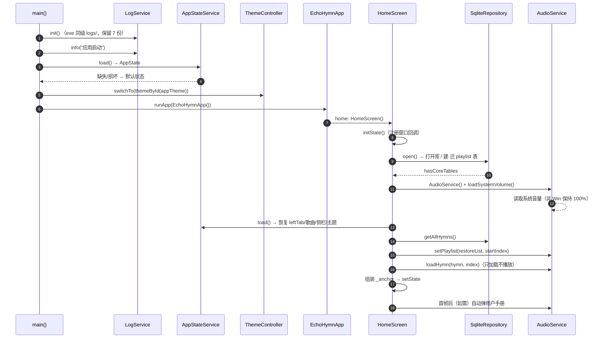
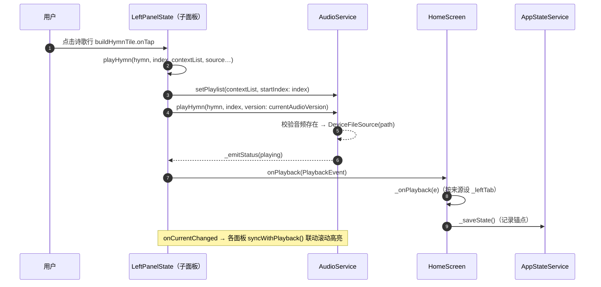
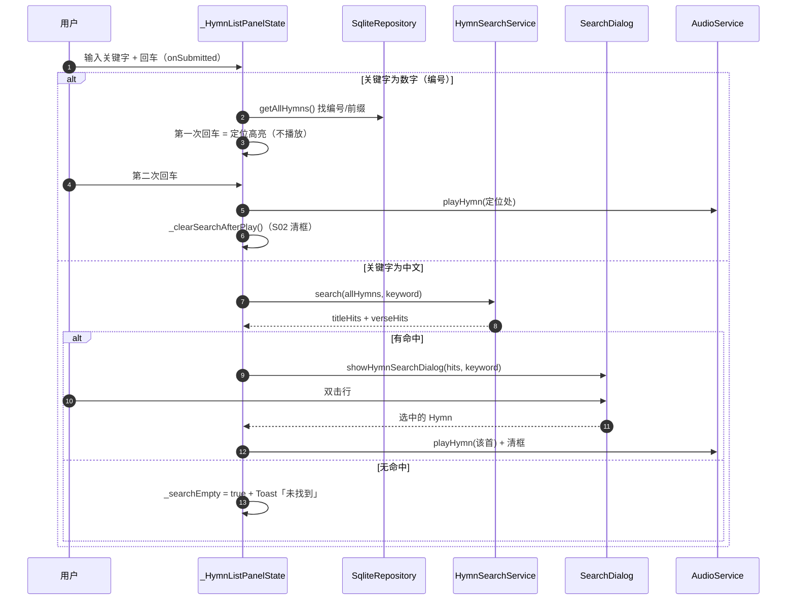
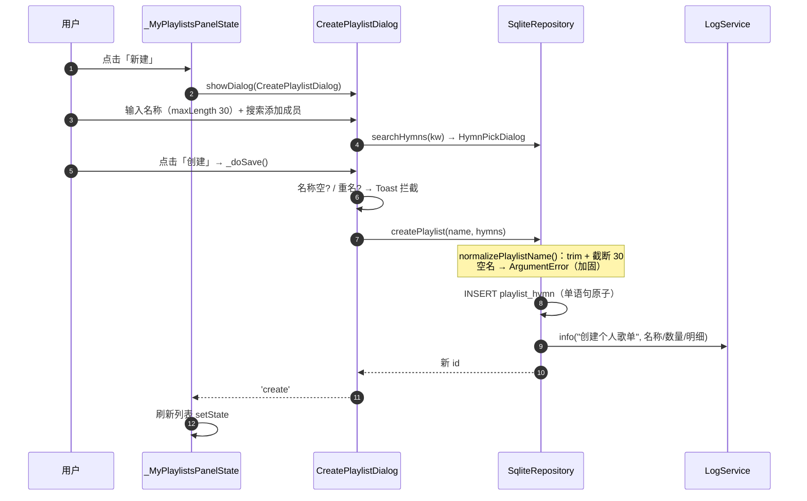
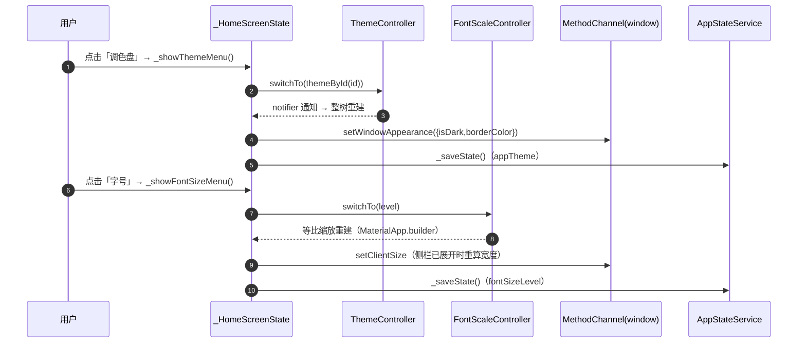
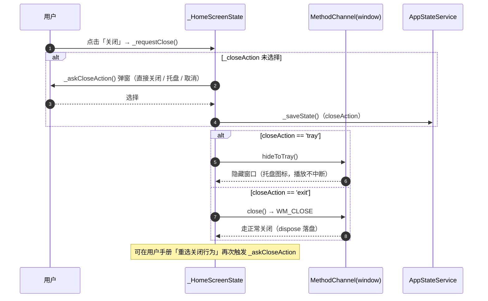
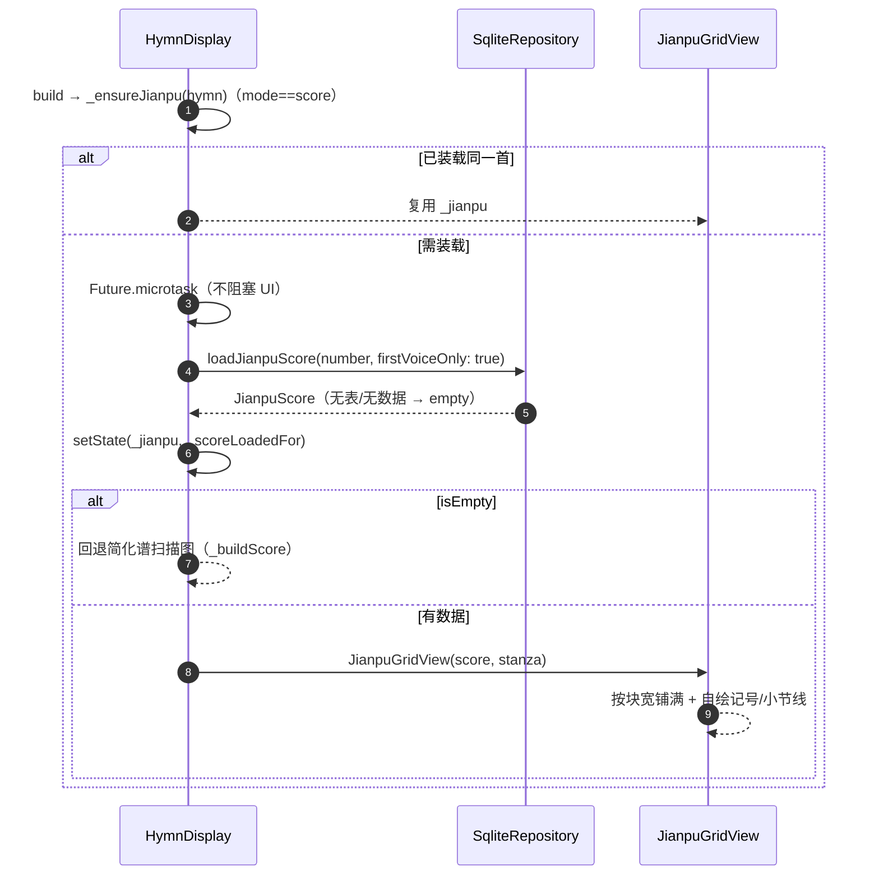
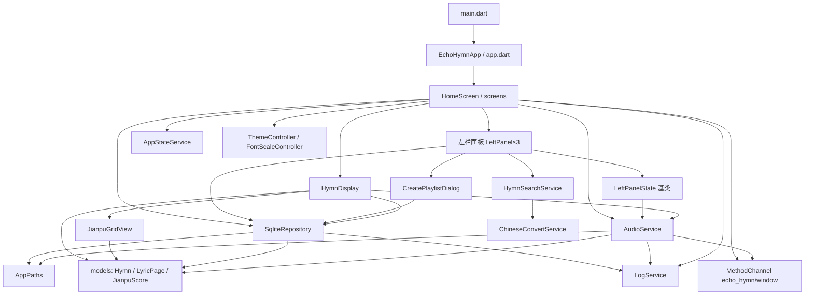
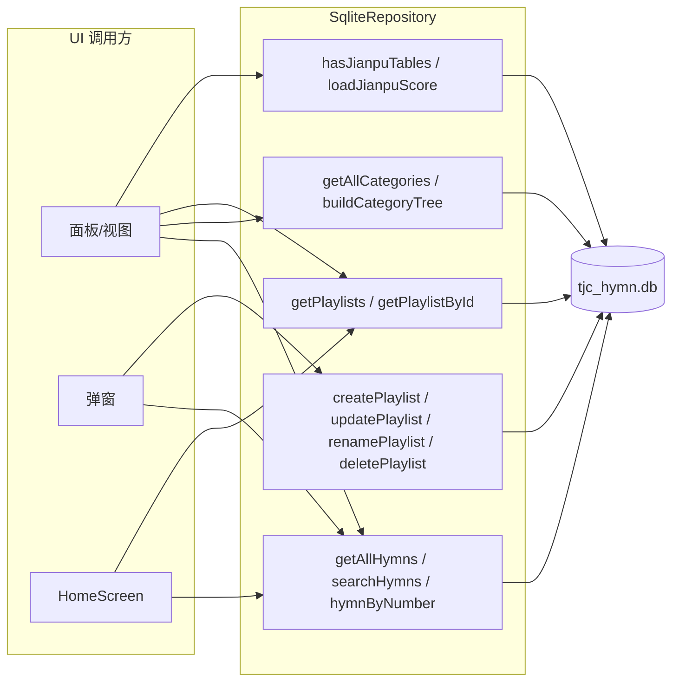
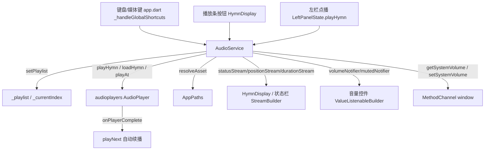

# EchoHymn 代码说明文档（接口 / 类 / 函数）

> **定位**：代码级 **API 参考 + 安全审查留档**。回答三个问题——
> 「有哪些对外接口 / 类 / 函数？」「怎么用（参数·返回·边界）？」「入参是否安全、调用关系如何？」。
>
> 与既有文档的分工：
>
> | 文档 | 回答的问题 |
> | --- | --- |
> | [UI_CONFIRMATION.md](UI_CONFIRMATION.md) | 界面长什么样（验收基准） |
> | [SESSION_SUMMARY.md](SESSION_SUMMARY.md) | 怎么一步步做出来的（开发史） |
> | **本文档** | **代码里有什么、怎么用、是否安全、谁调用谁** |
>
> - 扫描范围：`hymn_app/lib/**`（31 个 Dart 文件）+ `hymn_app/native/**`（C ABI 接口层）
> - 代码基线：**v1.8.0**
> - 生成日期：2026-10-03
> - 维护规则：**改代码 = 改本文档**（见「八、维护约定」）

---

## 一、总览

### 1.1 分层结构

```text
main.dart                    ← 入口：日志初始化 + 配色/字号恢复 + 全局异常捕获
  └─ app.dart                ← EchoHymnApp：MaterialApp / 主题 / 全局快捷键 / 等比缩放
       └─ screens/home_screen.dart   ← 协调者：布局 + 三面板切换 + 锚点状态保存
            ├─ widgets/hymn_display.dart   ← 主内容区：歌词/曲谱/简谱/五线谱 + 播放控制
            │    └─ widgets/jianpu_grid_view.dart  ← 简谱网格渲染（列 = 拍点）
            └─ widgets/panels/*            ← 左栏三面板（LeftPanel 基类 + 3 子类）

services/  ← 应用服务（无 UI 依赖）
  ├─ app_paths.dart          数据/资源路径解析
  ├─ app_state_service.dart  状态持久化（exe 同级 state.json，原子写）
  ├─ audio_service.dart      音频播放（audioplayers 封装）
  ├─ chinese_convert_service.dart 简繁转换门面（条件导入 native/stub）
  ├─ hymn_search_service.dart     歌名+歌词模糊搜索
  ├─ log_service.dart        日志（按天轮转，保留 7 份）
  └─ sqlite_repository.dart  SQLite 数据仓库（唯一落库入口）

models/  ← 纯数据模型      theme/ ← 调色板与字号    data/ ← 生成的常量表
```

**关键原则**：UI 不直接碰数据库/文件系统，一切经 `services/`；`SqliteRepository` 与
`AudioService` 是整个应用仅有的两个「有副作用边界」。

### 1.2 文件清单（31 个 Dart 源文件）

| 目录 | 文件 | 职责 |
| --- | --- | --- |
| lib/ | `main.dart` | 应用入口（异步引导） |
| lib/ | `app.dart` | 根组件 `EchoHymnApp` + `AppColors` + 全局快捷键 |
| lib/screens/ | `home_screen.dart` | 主界面协调者 |
| lib/services/ | `app_paths.dart` | 路径解析 |
| lib/services/ | `app_state_service.dart` | 状态持久化 |
| lib/services/ | `audio_service.dart` | 音频播放 |
| lib/services/ | `chinese_convert_service.dart` | 简繁转换门面 |
| lib/services/ | `chinese_convert_native.dart` | 简繁转换（桌面实现） |
| lib/services/ | `chinese_convert_stub.dart` | 简繁转换（Web 降级） |
| lib/services/ | `hymn_search_service.dart` | 搜索服务 |
| lib/services/ | `log_service.dart` | 日志服务 |
| lib/services/ | `sqlite_repository.dart` | 数据仓库 |
| lib/models/ | `hymn.dart` | 诗歌 / 歌词页模型 |
| lib/models/ | `hymn_category.dart` | 分类模型 |
| lib/models/ | `hymn_ref.dart` | 歌单成员 `{标题: 编号}` |
| lib/models/ | `jianpu_grid.dart` | 简谱网格模型（细胞/行/块/整曲） |
| lib/models/ | `jianpu_layout.dart` | 记谱字体字形度量 |
| lib/models/ | `playlist.dart` | 个人歌单模型 |
| lib/widgets/ | `hymn_display.dart` | 主内容区 |
| lib/widgets/ | `jianpu_grid_view.dart` | 简谱网格视图 |
| lib/widgets/ | `hymn_search_dialog.dart` | 搜索结果弹窗 |
| lib/widgets/ | `playlist_dialog.dart` | 歌单创建/修改弹窗 |
| lib/widgets/ | `user_manual_dialog.dart` | 用户手册弹窗 |
| lib/widgets/panels/ | `left_panel_base.dart` | 左栏面板抽象基类 |
| lib/widgets/panels/ | `hymn_list_panel.dart` | 诗歌列表面板 |
| lib/widgets/panels/ | `default_playlists_panel.dart` | 默认歌单面板 |
| lib/widgets/panels/ | `my_playlists_panel.dart` | 个人歌单面板 |
| lib/theme/ | `app_palette.dart` | 五套调色板 + `ThemeController` |
| lib/theme/ | `app_fonts.dart` | 字号等级 + `FontScaleController` |
| lib/data/ | `chinese_convert_map.dart` | 简繁映射表（生成） |
| lib/data/ | `jianpu_metrics.dart` | 记谱字形度量表（生成） |

---

## 二、接口说明（Interface）

> 本项目**没有 HTTP/RPC 服务**（桌面单机应用）。真正的「对外接口」只有三处：
> ① 原生 C ABI（`hymn_engine`，历史可选组件）；② 平台 MethodChannel（窗口控制）；
> ③ SQLite 表结构（数据契约）。

### 2.1 C ABI 接口 —— `hymn_app/native/hymn_engine/hymn_engine_capi.h`

> **现状**：Flutter 侧**已不再通过 `dart:ffi` 调用**（简繁转换与搜索已改为纯 Dart）。
> `native/` 为可选历史组件，源码与原生测试保留（`docs/README.md` 附录）。

| 函数签名 | 返回 | 失败语义 | 调用方责任 |
| --- | --- | --- | --- |
| `HymnEngineHymn* hymn_engine_create(void)` | 句柄 | 内存不足返回 `NULL` | 用完必须 `destroy` |
| `void hymn_engine_destroy(HymnEngineHymn*)` | — | 传入 `NULL` 安全 | — |
| `int hymn_engine_load_from_json(HymnEngineHymn*, const char* json)` | `1/0` | 空指针/解析失败 → `0` | — |
| `int hymn_engine_load_from_file(HymnEngineHymn*, const char* path)` | `1/0` | 空指针/读失败 → `0` | — |
| `int hymn_engine_count(HymnEngineHymn*)` | 数量 | 空句柄 → `0` | — |
| `char* hymn_engine_search(HymnEngineHymn*, const char* keyword)` | `"1,2,3"` | 空指针 → `NULL` | **返回值需 `free`** |
| `char* hymn_engine_get_field(HymnEngineHymn*, int id, const char* field)` | UTF-8 串 | 找不到/字段非法 → `NULL` | **返回值需 `free`** |
| `int hymn_engine_lyrics_stanza_count(HymnEngineHymn*, int id)` | 段数 | 找不到 → `-1` | — |
| `int hymn_engine_lyrics_line_count(HymnEngineHymn*, int id, int stanza)` | 行数 | `stanza<0` 或越界 → `-1` | — |
| `char* hymn_engine_lyrics_line(HymnEngineHymn*, int id, int stanza, int line)` | UTF-8 串 | `stanza/line<0` 或越界 → `NULL` | **返回值需 `free`** |

**接口契约（安全要点）**

- `field` 合法值仅 `title/author/composer/category/audio/number`；其它值返回 `NULL`（**白名单匹配**，见 `hymn_engine_capi.cpp`）。
- 有返回堆内存的接口**必须由调用方 `free`**，否则内存泄漏；`dupCString()` 内部用 `malloc`。
- 句柄类型为不透明指针，**跨线程不安全**（`HymnEngine` 无锁）。

### 2.2 平台 MethodChannel —— `echo_hymn/window`

Windows 原生窗口能力（`native` 侧 `flutter_window.cpp` 注册）。Dart 侧统一封装在
`home_screen.dart` 与 `audio_service.dart`，**非 Windows 平台调用会抛异常**，故全部用
`try/catch` 包住并静默降级。

| 方向 | Method | 参数 | 说明 |
| --- | --- | --- | --- |
| Dart→Native | `setClientSize` | `{width,height,leftPanelWidth,rightPanelWidth}` | 同步客户区/侧栏宽度 |
| Dart→Native | `setWindowAppearance` | `{isDark,borderColor}` | DWM 深色模式 + 边框色 |
| Dart→Native | `minimize` | — | 最小化 |
| Dart→Native | `maximizeToggle` | — | 最大化/还原 |
| Dart→Native | `startWindowDrag` | — | 进入系统拖拽循环 |
| Dart→Native | `close` | — | WM_CLOSE 正常关闭（状态落盘） |
| Dart→Native | `hideToTray` | — | 隐藏到系统托盘（播放不中断） |
| Dart→Native | `getSystemVolume` | — | 读系统音量 `{volume,muted}` |
| Dart→Native | `setSystemVolume` | `{volume,muted}` | 写系统音量（双向同步） |
| Native→Dart | `onWindowMaximizedChanged` | `bool` | 推送最大化状态（切按钮图标） |

### 2.3 数据契约 —— SQLite 表（`data/tjc_hymn.db`）

| 表 | 用途 | 关键列 |
| --- | --- | --- |
| `tjc_hymn` | 诗歌主表 | `id, hymn_number, title, lyricist, composer, source_info, verse_1..N, chorus, audio_versions(JSON), audio_version_list(JSON), audio_durations(JSON), staff_img_path, numbered_img_path, staff_png_path, numbered_png_path` |
| `hymn_category` | 默认歌单分类 | `id, category, subcategory, hymns(JSON [{标题:编号}])` |
| `playlist_hymn` | 个人歌单（**单表**） | `id, name, hymns(JSON), created_at, updated_at` |
| `jianpu_score` | 简谱曲目头 | `hymn_number, source, stanza_count` |
| `jianpu_row` | 简谱网格行 | `hymn_number, line_no, block_no, kind, stanza_no, col_count` |
| `jianpu_cell` | 简谱网格单元格 | `hymn_number, line_no, col, kind, sym, degree, accidental, dot_len, octave, dots, beams, fermata, rowspan, text` |

**契约要点**

- `hymn_number` **一律按字符串处理**（兼容 `51_a` / `124_b` 甲乙变体编号）。
- `hymns` 字段格式恒为 `[{标题: 编号}]`，编号为字符串（`hymn_ref.dart` 统一归一）。
- **核心不变式**：`jianpu_cell` 中**同一列 = 同一拍点**（音符/记号/小节线/歌词音节同列对齐）。
- 历史表 `playlist`、`playlist_hymn_old` 由 `_ensurePlaylistTable()` 自动迁移并删除。
- 表缺失（删库/空库）时各查询返回空列表，**不抛异常**（UI 显示空态）。

---

## 三、类说明（Class）

> 每个类给出：**职责 / 关键成员 / 生命周期 / 并发与不变量 / 相关类**。
> 「生命周期」指对象的创建与销毁时机；「并发」指是否线程安全。

### 3.1 入口与根组件

#### `EchoHymnApp`（`lib/app.dart`，StatelessWidget）

- **职责**：根组件。构建 `MaterialApp`（主题 / `kNavigatorKey` / 全局快捷键 `Focus`）+ 全局等比缩放 `builder`。
- **关键成员**：`_handleGlobalShortcuts`（媒体键 / `Ctrl+P` / F1）、`AppColors`、`kNavigatorKey`。
- **生命周期**：随 `runApp` 创建一次；`build` 内用 `ValueListenableBuilder` 监听 `ThemeController` 重建。
- **并发**：UI 单线程。
- **相关**：`HomeScreen`、`ThemeController`、`FontScaleController`。

#### `AppColors`（`lib/app.dart`）

- **职责**：主题色**门面**——所有色槽从「当前调色板」取值，换肤 = 换 `ThemeController` 的调色板。
- **不变量**：**UI 代码不得直接写死颜色**，一律走本类（保证换肤全覆盖）。

#### `_HymnDisplayState` 内部件（`_ScoreImageView`）

- **职责**：谱面图片查看器（简谱/五线谱扫描图），宽度驱动缩放 + 滚轮语义分流（`Ctrl+滚轮`=缩放，普通滚轮=滚动）。

### 3.2 服务层

#### `AppPaths`（`lib/services/app_paths.dart`）

- **职责**：定位数据根目录与数据库路径；把库内相对路径解析为平台绝对路径。
- **关键成员**：`init()`（幂等）、`databasePath`、`resolveAsset(relative)`、`isMobile`。
- **不变量**：桌面**向上查找只认「含 `tjc_hymn.db` 的 `data/`」**；发布包目录（`echohymn_win_*`）**禁止向上查找**。
- **相关**：`SqliteRepository.open()`、`AudioService`。

#### `AppStateService` / `AppState`（`lib/services/app_state_service.dart`）

- **职责**：`state.json` 持久化（便携：与 `echo_hymn.exe` 同级）。
- **关键成员**：`shared`（全局单例）、`saveAll()`、`updateManualOnStart()`、`load()`；模型 `AppState`（14 字段）。
- **原子性**：**先写 `.tmp` 再 `rename`**；所有写入经**同一 `_writeChain` 串行队列**，避免并发写坏文件。
- **容错**：文件缺失/损坏 → 返回默认状态，**绝不抛异常导致启动失败**。
- **不变量**：`playlistIndex = -1` 表示「未记录」；空串字段表示「用默认值」。

#### `LogService` / `LogTag` / `LogLevel`（`lib/services/log_service.dart`）

- **职责**：按天轮转日志（`logs/app_yyyy-MM-dd.log`，**保留 7 份**）。
- **关键成员**：`instance`、`init({ensureExeDir})`、`info/warning/error/exception`。
- **编码**：**UTF-8 with BOM**（防 PowerShell/记事本按 GBK 解码中文乱码）。
- **并发**：写入经 `_writeChain` 串行；**写失败静默**（不影响应用）。

#### `AudioService`（`lib/services/audio_service.dart`）

- **职责**：封装 `audioplayers`；管理播放列表、当前歌曲、音量/静音、系统音量双向同步。
- **关键成员**：`instance`（全局引用）、`statusStream/positionStream/durationStream`、`volumeNotifier/mutedNotifier`（**UI 与快捷键共用的唯一数据源**）、`playlist/currentIndex/currentHymn`、`playHymn/loadHymn/setPlaylist/playAt/togglePlayPause/playNext/playPrev/seek/setVolume/changeVolume/toggleMute/loadSystemVolume`。
- **播放模型**：用 `DeviceFileSource(path)` 直传路径（规避中文路径 URI 编码）；`_volume` 即**系统音量**，播放器增益恒 `1.0`（防 v² 双重衰减）。
- **不变量**：`_currentIndex` 应落在 `[0, _playlist.length)`；`_actualAudioVersion`（实际播放）与 `_currentAudioVersion`（用户记忆）分离，**降级不覆盖记忆**。
- **并发**：`playAt` 250ms 防抖；流订阅在 `dispose` 取消。

#### `ChineseConvertService`（`lib/services/chinese_convert_service.dart`）

- **职责**：简繁转换门面。**条件导入**：`dart.library.io` → 纯 Dart 查表（`chinese_convert_native.dart`）；Web → stub 返回原文。
- **不变量**：**逐字 1:1 映射、等长**（未命中字符原样保留，绝不抛错）。

#### `HymnSearchService` / `HymnSearchHit`（`lib/services/hymn_search_service.dart`）

- **职责**：歌名+歌词统一模糊搜索。
- **关键成员**：`normalizedKeyword`、`search(all, keyword)`。
- **排序不变量**：**歌名命中在前、歌词命中在后**，组内保持编号升序；每首只产出一条。

#### `SqliteRepository`（`lib/services/sqlite_repository.dart`）

- **职责**：**唯一**数据落库入口；打开数据库、自动建/迁表、各查询与写入。
- **关键成员**：`open()`、`hasCoreTables`、`getAllHymns/searchHymns/getHymnsPage/hymnByNumber/hymnById`、`getAllCategories/buildCategoryTree`、`getPlaylists/getPlaylistById/createPlaylist/updatePlaylist/renamePlaylist/deletePlaylist`、`hasJianpuTables/loadJianpuScore`、`dispose()`。
- **不变量**：SQL **全部用绑定参数**（`?`）；核心表缺失时查询返回空、**不抛异常**。
- **并发**：`sqlite3` 同步 API，UI 单线程串行访问；不跨 isolate 共享。

### 3.3 模型层（纯数据，全部不可变）

| 类 | 文件 | 职责 / 关键点 |
| --- | --- | --- |
| `Hymn` | `models/hymn.dart` | 诗歌实体（对应 `tjc_hymn`）；`lyricPages` 把「节 + 副歌」组织成翻页单位；`parseAudioVersions/Durations` 容错解析 JSON |
| `LyricPage` | `models/hymn.dart` | 一页歌词 = 一节正歌 + 副歌；`lineCount`/`maxDisplayWidth` 供「铺满自适应字号」 |
| `HymnCategory` | `models/hymn_category.dart` | 分类（`hymn_category`）；`hymns` 为 `[{标题:编号}]` |
| `HymnRef` | `models/hymn_ref.dart` | 歌单成员 `typedef MapEntry<String,String>`；`hymnRefNumber` 归一化编号为字符串 |
| `Playlist` | `models/playlist.dart` | 个人歌单（`playlist_hymn` 单表） |
| `JianpuCell`/`JianpuRow`/`JianpuBlock`/`JianpuScore` | `models/jianpu_grid.dart` | 简谱网格四层模型；`JianpuScore.build(firstVoiceOnly:)` 支持「只取第一声部」 |
| `JianpuGlyph` | `models/jianpu_layout.dart` | 记谱字形度量（码位 → 墨迹宽/上下界） |

**顶层工具函数（`models/hymn.dart`）**：`autoPageIndexFor`（按进度换算页码）、
`lyricMaxFontByHeight` / `lyricMaxFontByWidth`（字号铺满双约束）。

### 3.4 主题层

#### `AppPalette` / `ThemeController`（`lib/theme/app_palette.dart`）

- **职责**：五套调色板（`kThemes`）+ 全局切换控制器（`ValueNotifier<AppPalette>`）。
- **不变量**：`AppPalette.id` 与 `state.json` 的 `appTheme` 对应；`themeById` 找不到回退默认（**容错**）。

#### `FontSizeLevel` / `FontScaleController` / `AppFonts`（`lib/theme/app_fonts.dart`）

- **职责**：四档字号等级（1.0/1.3/1.6/1.9）× 全局等比缩放。
- **实现**：`MaterialApp.builder` 用 `Transform.scale` 缩放整棵 Navigator；歌词区另按 `AppFonts.lyricsScale` 处理。
- **不变量**：`fontSizeLevelById` 找不到回退 `normal`。

### 3.5 视图层

#### `HomeScreen` / `_HomeScreenState`（`lib/screens/home_screen.dart`）

- **职责**：**协调者**——顶栏/主体/右栏/状态栏布局、左栏三 Tab 切换、锚点状态保存、播放来源同步、窗口控制。
- **关键方法**：`_init()`（打开库 → 建 `AudioService` → 恢复状态 → 恢复歌曲）、`_saveState()`、`_buildLeftPanel/_buildRightPanel/_buildTopBar/_buildStatusBar`、`_syncWindowSize/_syncWindowAppearance`、`_requestClose/_hideToTray/_rechooseCloseAction`、`_onPlayback`。
- **生命周期**：`initState` 注册窗口回调 → `dispose` 注销回调 + 保存状态 + 释放 repo/audio。
- **并发**：`WidgetsBindingObserver` 监听生命周期（`paused/inactive/detached` 时保存状态）。

#### `HymnDisplay` / `_HymnDisplayState`（`lib/widgets/hymn_display.dart`）

- **职责**：主内容区（版本栏 + 歌词/曲谱/简谱/五线谱 + 播放控制 + 音量）。
- **关键方法**：`_pageCount`、`_applyAutoPage`（按播放进度翻页）、`_resetPageIfNeeded`、`_turnPage`、`_toggleAutoPaging`、`_setMode`、`_switchVersion`、`_buildLyrics/_buildJianpu/_buildScore`、`_buildVolumeControl`、`_ensureJianpu`。
- **不变量**：`_page` 恒落在 `[0, pages-1]`；切歌/切版本 → 复位第 1 页（`_pageKey` 判定）。

#### `LeftPanel` / `LeftPanelState<P>`（`lib/widgets/panels/left_panel_base.dart`）

- **职责**：左栏三面板**抽象基类**（公共依赖 + 公共行为 + 抽象钩子）。
- **公共成员**：`playHymn`（设置播放上下文 + 播放 + 通知上层）、`scrollToCurrent` / `scrollCurrentIntoView`（滚动工具）、`audio/repo/currentHymn/currentPlaylist/currentIndex` 简写。
- **抽象钩子**：`restoreSaved(anchor)`、`syncWithPlayback()`、`buildHymnTile(hymn,index,contextList)`。
- **生命周期**：`anchor` 首次挂载/变化 → 帧后调 `restoreSaved`。

#### `PlaybackEvent`（`lib/widgets/panels/left_panel_base.dart`）

- **职责**：面板 → `HomeScreen` 的播放事件 DTO（`contextList/hymn/index/sourceSubcategory/sourcePlaylistName`）。

#### 三个面板子类

| 类 | 文件 | 职责 | 抽象接口实现要点 |
| --- | --- | --- | --- |
| `HymnListPanel` | `panels/hymn_list_panel.dart` | 全部诗歌分页（每页 35 首）+ 搜索定位 | 编号搜索=两次回车（定位→播放）；中文搜索=弹窗为准，双击播放 |
| `DefaultPlaylistsPanel` | `panels/default_playlists_panel.dart` | 分类树 → 二级目录 → 诗歌列表 | 播放来源 = `sourceSubcategory` |
| `MyPlaylistsPanel` | `panels/my_playlists_panel.dart` | 歌单列表（增删改）+ 歌单诗歌列表 | 播放来源 = `sourcePlaylistName`；编辑后同步播放上下文 |

#### 弹窗与视图组件

| 类 / 函数 | 文件 | 职责 |
| --- | --- | --- |
| `showHymnSearchDialog` / `_HymnSearchDialog` / `buildKeywordSpans` | `widgets/hymn_search_dialog.dart` | 统一搜索结果弹窗（单击选中 / 双击返回并播放） |
| `CreatePlaylistDialog` / `HymnPickDialog` | `widgets/playlist_dialog.dart` | 歌单创建/修改/删除 + 诗歌选择 |
| `UserManualDialog` / `ManualPrefs` / `GuideLine` | `widgets/user_manual_dialog.dart` | 用户手册弹窗 + 「启动时显示」偏好单例 |
| `JianpuGridView` / `_Metrics` / `_FermataPainter` | `widgets/jianpu_grid_view.dart` | 简谱网格渲染（列 = 拍点，按块宽铺满） |
| `_ScoreImageView` | `widgets/hymn_display.dart` | 谱面图片查看器（宽度驱动缩放 + 滚轮分流） |
| `_WindowButton` / `_EmptyHint` | `home_screen.dart` / 各面板 | 无状态 UI 原子件（窗口按钮、空态提示） |

---

## 四、函数说明（Function）

> 只列**有契约价值**的函数（有参数/返回值/副作用/边界的）。格式：
> **签名** → 参数 / 返回 / 边界与失败 / 副作用。

### 4.1 服务层函数

#### `AppPaths`

| 函数 | 参数 | 返回 | 边界 / 失败 | 副作用 |
| --- | --- | --- | --- | --- |
| `init()` | — | `Future<void>` | 幂等（`_dataRoot != null` 直接返回） | 写静态 `databasePath`；记日志 |
| `resolveAsset(relative)` | `relative` 库内相对路径 | 平台绝对路径 | `''` → `''`；含 `:\` 或 `file:` → **原样返回** | 无（纯函数） |
| `_locateDesktopDataRoot()` | — | `data/` 目录或 `null` | 最多向上 12 层；发布包目录禁向上 | 无 |

#### `AppStateService`

| 函数 | 参数 | 返回 | 边界 / 失败 | 副作用 |
| --- | --- | --- | --- | --- |
| `saveAll({...14})` | 全部状态字段（多数 required） | `Future<void>` | 异常被 `catchError` 吞掉 | **排队写 `state.json`**（原子） |
| `updateManualOnStart(value)` | `bool` | `Future<void>` | 读→改单键→原子写；损坏文件视作空 | 写 `state.json`（同一串行队列） |
| `load()` | — | `Future<AppState>` | 文件缺失/JSON 非法/类型不符 → **默认状态** | 无 |

#### `AudioService`

| 函数 | 参数 | 返回 | 边界 / 失败 | 副作用 |
| --- | --- | --- | --- | --- |
| `setPlaylist(hymns, {startIndex})` | 新列表、起始下标 | `void` | `startIndex` 仅在 `[0,len)` 生效（否则保留原值） | 换播放上下文 |
| `playHymn(hymn, {index, version})` | 诗歌、下标、版本 | `Future<void>` | **无音频/路径空 → 置 `error` 状态并返回**；版本不可用自动降级 | 播放；置 `_actualAudioVersion`；触发 `onCurrentChanged` |
| `loadHymn(hymn, {index, version})` | 同上 | `Future<void>` | 只加载不播放 | 停止旧源，进度归零 |
| `playAt(index)` | 下标 | `Future<void>` | `index` 越界 → 直接返回；**250ms 防抖** | 播放 |
| `playNext()/playPrev()` | — | `Future<void>` | 空列表 → 返回；**循环取模** | 播放 |
| `setVolume(volume)` | `0.0~1.0` | `Future<void>` | **`clamp(0,1)`**；`>0` 自动取消静音 | 写系统音量（`_syncToSystem`） |
| `changeVolume(delta)` | 增量 | `Future<void>` | 经 `setVolume` 钳制 | 同上 |
| `toggleMute()` | — | `Future<void>` | 只切增益（0/1.0），**音量数值不动** | 写系统静音 |
| `loadSystemVolume()` | — | `Future<void>` | 非 Windows 无通道 → 保持 100% | 初始化音量 + 启动 1s 轮询 |

#### `SqliteRepository`

| 函数 | 参数 | 返回 | 边界 / 失败 | 副作用 |
| --- | --- | --- | --- | --- |
| `open()` | — | `Future<SqliteRepository>` | 缺表仍可用（`hasCoreTables=false`） | 打开库、**建/迁 playlist 表**、记日志 |
| `searchHymns(keyword)` | 关键字 | `List<Hymn>` | 空 → 全部；数字→编号优先，否则标题 | 无 |
| `hymnByNumber(number)` | 编号（字符串） | `Hymn?` | 无表/无记录 → `null` | 无 |
| `createPlaylist(name, [hymns])` | 名称、成员 | `int`（新 id） | **名称空白 → 抛 `ArgumentError`；自动 trim + 截断 30 字**（v1.8.0 加固） | INSERT（**单语句原子**） |
| `updatePlaylist(id, name, hymns)` | id、名称、成员 | `void` | **id 不存在 → 记 warning 并返回**；名称校验同 `create` | UPDATE |
| `renamePlaylist(id, newName)` | id、新名 | `void` | **id 不存在 → 记 warning 并返回**；名称校验同 `create` | UPDATE |
| `deletePlaylist(id)` | id | `void` | id 不存在 → 记 warning（仍执行删除，幂等） | DELETE |
| `loadJianpuScore(number, {firstVoiceOnly})` | 编号、是否只取第一声部 | `JianpuScore` | 无三表/无数据 → `JianpuScore.empty` | 无 |

⚠️ **安全契约（务必遵守）**：

> - 所有 SQL 一律**绑定参数**（`?`），**禁止字符串拼接用户输入**；
> - 唯一例外 `PRAGMA table_info($table)` —— 表名**只能来自内部常量**，不得接受外部输入；
> - `createPlaylist/updatePlaylist/renamePlaylist` 的 `name` 已在仓储层做 **trim + 空校验 + 长度上限**（v1.8.0 起，见「五」）。

### 4.2 模型与视图函数

| 函数 | 参数 | 返回 | 边界 / 失败 | 副作用 |
| --- | --- | --- | --- | --- |
| `Hymn.lyricPages` | — | `List<LyricPage>` | 无正歌有副歌 → 单页副歌；两者皆空 → `[]` | 无（纯计算） |
| `autoPageIndexFor({position,totalSeconds,pageCount})` | 进度、总时长、页数 | `int`（0 基页） | `totalSeconds<=0` 或 `pageCount<=1` → 恒 `0` | 无 |
| `lyricMaxFontByHeight(availH,lineCount)` | 可用高、行数 | `double` | `lineCount<=0` → `40.0` | 无 |
| `lyricMaxFontByWidth(availW,maxDisplayWidth)` | 可用宽、最长行宽 | `double` | `maxDisplayWidth<=0` → `40.0` | 无 |
| `JianpuScore.build({...firstVoiceOnly})` | 行数据等 | `JianpuScore` | 空行 → 空 score；`firstVoiceOnly` 过滤非第一声部 | 无 |
| `HymnSearchService.search(all, keyword)` | 全量、关键字 | `List<HymnSearchHit>` | 空关键字 → `[]`；每首仅一条 | 无 |
| `buildKeywordSpans(text,keyword,color,base)` | 文本/关键字/色/样式 | `List<InlineSpan>` | 关键字未出现 → 单段原样 | 无 |
| `LeftPanelState.playHymn(hymn,index,contextList,{...})` | 诗歌/下标/上下文/来源 | `void` | — | 设置播放上下文 + 播放 + 回调上层 + `setState` |
| `LeftPanelState.scrollCurrentIntoView(ctrl,index,{headerHeight,force})` | 控制器/下标/头部高/强制 | `void` | `!hasClients` → 返回；行已可见且非 `force` → 不动 | 滚动（`jumpTo`） |

---

## 五、安全与完整性审查（接口 / 类 / 函数视角）

> 审查方法：**以「入参」为切入点**逐层过一遍——
> ① 这个函数会被谁以什么参数调用？② 非法/恶意/边界参数会怎样？
> ③ 失败时是否静默吞掉、是否留下脏数据？④ 是否有契约未写明导致误用？

### 5.1 审查结论总表

| 编号 | 级别 | 位置 | 问题 | 处理 |
| --- | --- | --- | --- | --- |
| SEC-01 | **P1** | `SqliteRepository.create/update/renamePlaylist` | 歌单名称入参**仓储层无校验**：空/纯空白/超长名可直接落库（此前仅依赖 UI `maxLength`+`trim`） | ✅ **已加固**（见 5.3） |
| SEC-02 | **P2** | `SqliteRepository.update/rename/deletePlaylist` | 对**不存在的 id** 静默无操作，无日志，难排查 | ✅ **已加固**（告警日志，见 5.3） |
| SEC-03 | **P2** | `AudioService.playHymn/loadHymn` | `index` 入参**未做越界钳制**，可能把 `_currentIndex` 置为非法值 | ✅ **已加固**（见 5.3） |
| SEC-04 | P2 | `SqliteRepository._tableHasColumn` | `PRAGMA table_info($table)` 用字符串插值（潜在注入面） | ⚠️ **约束**：表名只能来自内部常量；已在文档与注释中固化契约，代码保持 |
| SEC-05 | P2 | `SqliteRepository.searchHymns` | `LIKE '%$kw%'` 中用户输入的 `%` / `_` 会被当作通配符 | 📌 **已知行为**（非注入；仅影响模糊度），记录待评估 |
| SEC-06 | P3 | `AppStateService._statePath` | 路径拼接硬编码 `\`（Windows-only） | 📌 可接受（目标平台为 Windows） |
| SEC-07 | P3 | C ABI 返回 `char*` | 调用方需 `free`，否则泄漏 | 📝 **契约已写明**（见 2.1） |

**判定为「安全」并已确认的点**：

- 所有查询/写入 SQL **均使用绑定参数**（`searchHymns` / `hymnByNumber` / `loadJianpuScore` / 歌单 CRUD），**无 SQL 注入**；
- `AudioService.playAt` 已有越界守卫；`setPlaylist` 的 `startIndex` 已限区间；`setVolume` 已 `clamp(0,1)`；
- `HymnSearchService` / `chinese_convert` 对空串、未命中字符**均安全降级**，不抛错；
- 所有 `MethodChannel` 调用**均已 `try/catch`**，非 Windows 平台静默降级，不会因缺通道崩溃；
- 库文件缺失/损坏路径（`hasCoreTables=false`、`load()` 容错）**均已覆盖**，不导致启动失败。

### 5.2 逐类完整性检查（是否「完整」）

| 检查项 | 结论 |
| --- | --- |
| 公开类是否都有职责说明 | ✅ 本文档「三」全覆盖 |
| 有副作用的方法是否标注副作用 | ✅ 本文档「四」逐条标注 |
| 边界（空/越界/缺表/缺文件）是否明确 | ✅ 已在「四」的「边界/失败」列写明 |
| 异常是否被吞且无痕迹 | ⚠️ `AppStateService`/`LogService`/`_writeLine` 有意静默（I/O 容错），已文档化 |
| 单例/生命周期是否说明 | ✅（`AudioService.instance`、`ThemeController.instance`、`AppStateService.shared`、`ManualPrefs.instance`） |

### 5.3 已实施的优化（v1.8.0 加固）

**① 仓储层：歌单名称与 id 入参防御**（`lib/services/sqlite_repository.dart`）

- 新增 `kPlaylistNameMaxLength = 30` 与顶层 `normalizePlaylistName(name)`：
  **trim 首尾空白 + 截断到 30 字**（与 UI `TextField.maxLength` 对齐）。
- `createPlaylist` / `updatePlaylist` / `renamePlaylist`：名称先归一化；
  **归一化后为空 → 抛 `ArgumentError`**（编程错误，快速暴露而不是写脏数据）。
- `updatePlaylist` / `renamePlaylist`：**id 不存在 → 记 `warning` 日志并返回**（不改库）。
- `deletePlaylist`：id 读不到 → 记 `warning`（删除本身幂等，仍执行）。

> 设计取舍：**不静默截断调用方的错误**——用 `ArgumentError` 让调用方（UI 已先行校验）
> 的疏漏在开发期即暴露；长度上限用截断而非抛错，避免极端粘贴场景直接崩溃。

**② 播放层：索引入参钳制**（`lib/services/audio_service.dart`）

- `playHymn` / `loadHymn`：`index` 仅在 `[0, _playlist.length)` 时写入 `_currentIndex`，
  否则忽略（保持原值），杜绝「越界下标污染当前索引」。

### 5.4 后续建议（未实施）

- **SEC-05**：如担心用户输入 `%`/`_` 影响模糊匹配语义，可在 `searchHymns` 内对
  `kw` 做 `replaceAll('%','\\%').replaceAll('_','\\_')` 转义，并在 SQL 中加 `ESCAPE '\'`。
- 若未来把「歌单重名检查」也下沉到仓储层，可让 `createPlaylist` 直接拒绝重名，
  使「重名不可存在」成为**数据层不变量**（当前由 UI 保证）。

---

## 六、时序图（Mermaid）

> 用 Mermaid `sequenceDiagram` 描述**所有关键操作动作**的调用时序。
> 在支持 Mermaid 的查看器（VS Code Markdown Preview Mermaid、GitHub、Typora）
> 中可直接渲染；纯文本环境下亦保留可读的箭头语义。

### 6.1 启动与状态恢复



### 6.2 左栏点播（含播放来源同步）



### 6.3 搜索定位（编号两次回车 / 中文弹窗）



### 6.4 歌单创建（含 v1.8.0 入参加固点）



### 6.5 换肤 / 字号切换



### 6.6 关闭按钮 → 直接关闭 / 进入托盘



### 6.7 曲谱（简谱网格）异步装载



---

## 七、调用图（Mermaid）

> 时序图回答「一次操作怎么走」；调用图回答「**谁调用谁**」的静态结构。
> 下列 `graph` 覆盖应用的三大调用主干：UI → 服务 → 数据/原生。

### 7.1 类级调用主干



### 7.2 数据访问调用图（读 / 写）



### 7.3 播放调用图



---

## 八、维护约定

1. **改代码 = 改本文档**：新增/修改公开接口、类、函数或安全契约时，同步更新对应小节；
2. 新增「入参有边界」的函数，必须在「四」的表中补 `边界/失败` 列；
3. 发现新的入参风险，按 `SEC-NN` 编号登记到「五」的总表，并标注处理状态；
4. 文档随本次代码改动一起 `git add docs/Windows/` 提交。

> 关联文档：[UI_CONFIRMATION.md](UI_CONFIRMATION.md)（界面基准）·
> [SESSION_SUMMARY.md](SESSION_SUMMARY.md)（开发史）·
> [RELEASE_RULES.md](RELEASE_RULES.md)（发布规范）·
> `docs/knowledge/TJC_APK_JIANPU_RENDER.md`（简谱网格机制）。
